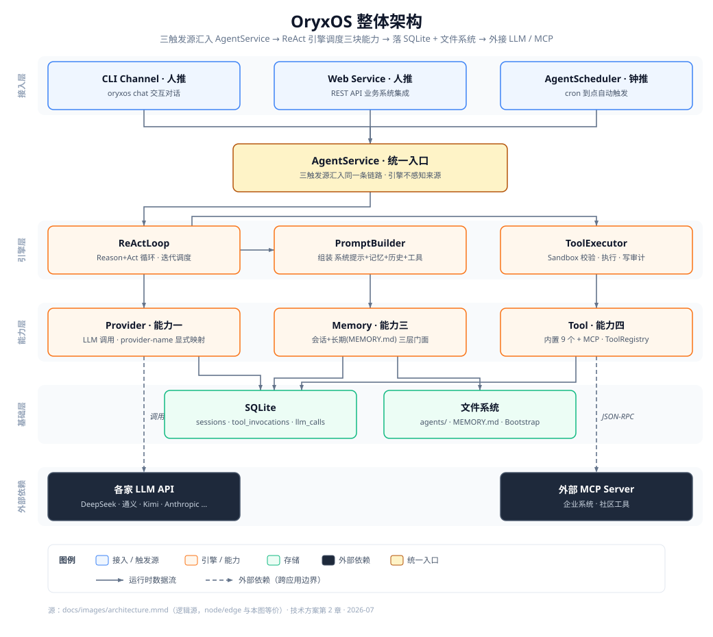

<div align="center">

# OryxOS

**面向企业的 Java 原生 Agent OS —— 私有、可控、可审计的智能体统一底座**

<!-- 徽章：静态声明，非 CI 实时状态 -->


简体中文 · [English (planned)](#)

</div>

---

> **项目状态**：OryxOS 处于活跃开发阶段，正迈向 1.0。核心阶段交付 Agent OS 的**运行时内核**；下文中的命令与用法描述的是目标形态。企业级治理层（多租户、SSO、完整审计、Tool 治理）在扩展阶段与社区共建中陆续补齐。

## 目录

- [OryxOS 是什么](#oryxos-是什么)
- [为什么需要它](#为什么需要它)
- [核心能力](#核心能力)
- [架构总览](#架构总览)
- [快速开始](#快速开始)
- [定义一个 Agent](#定义一个-agent)
- [扩展工具（Plugin Tool 三档）](#扩展工具plugin-tool-三档)
- [Web Service](#web-service)
- [路线图](#路线图)
- [参与贡献](#参与贡献)
- [文档](#文档)
- [许可证](#许可证)
- [致谢](#致谢)

## OryxOS 是什么

**OryxOS 是一个用 Java 实现、面向企业场景的 Agent OS（智能体操作系统底座）。** 它装在企业自己的 K8s、服务器或物理机上，作为统一底座在其上跑各种业务 Agent（运维助手、客服助手、HR 助手、销售助手、知识管理助手……），让它们**共享一套渠道接入、模型路由、工具调用、记忆系统、沙箱执行能力**。

数据完全留在企业自己的基础设施上，**不外发、不锁任何云生态**。业务方只需写一个 Agent 目录 + 配置工具，就能上线一个新 Agent —— **不需要写 Agent 后端代码**。

> **Agent OS ≠ Agent 框架 / 编排平台**：框架给你代码要你自己搭运行环境（如 Spring AI、LangChain4j）；编排平台给你可拖拽的流程跑在运行时之上（如 Dify、Coze）；**OryxOS 给你运行时本身** —— 一个让 Agent 能常驻、可治理、可审计地跑起来的底座。三者是复用与互补关系，不是竞争。

## 为什么需要它

严监管企业（银行、政府、电信、能源、医疗）对 AI Agent 有几条铁律：**数据不出企业、系统完全可审计、纳入现有安全合规流程、技术栈与现有体系对齐**。这让 SaaS 方案和绑定公有云的产品都被排除。

而开源 Agent OS 领域，`OpenClaw`（Node.js）偏个人、`Hermes`（Python）偏小团队，**Java 生态在 Agent OS 这一层完全空白**。企业现有的 ERP、CRM、CMDB、SSO、监控大量是 Java 接口，Spring AI Alibaba 也已把底层 LLM 调用解决 —— 缺的就是上面那一层"Agent OS"。**OryxOS 来填这个位置。**

## 核心能力

<table>
<tr>
<td width="33%" valign="top">

### 🔌 对接 LLM
Provider 抽象层统一对接 DeepSeek、通义、Kimi、智谱、混元、豆包、Anthropic、OpenAI 等，Agent 不感知调的是哪家，**运行时切换无 lock-in**。也可接本地推理（Ollama、vLLM）。

</td>
<td width="33%" valign="top">

### 🧠 ReAct 循环
Agent 的大脑：LLM 思考 → 调工具 → 看结果 → 再决定，直到给出最终响应。**多步骤任务自主完成**，业务方不需要预先编排流程。

</td>
<td width="33%" valign="top">

### 💾 三层记忆
Agent 跨对话记得住用户偏好、项目背景、关键决策。核心阶段落地会话记忆 + 长期记忆（`MEMORY.md`），情景记忆随扩展补齐。

</td>
</tr>
<tr>
<td width="33%" valign="top">

### 🛠️ Plugin 工具 + 内置工具集
内置文件 / Shell / HTTP / 通知 / 记忆工具；业务方三档扩展：**零代码**（AGENT.md + MCP）、**轻代码**（自写 MCP server）、**重代码**（Java `@Tool`）。

</td>
<td width="33%" valign="top">

### 🌐 Web Service
完整 REST API 把所有能力对外暴露，业务系统一个 HTTP 请求即可用上 Agent。**这是 OryxOS 区别于个人级项目的关键能力。**

</td>
<td width="33%" valign="top">

### ⏰ 三种触发源
CLI（人推）、Web Service（人推）、`AgentScheduler`（钟推，cron 到点自动跑）—— 三者汇入同一条 `AgentService` 链路，行为一致。

</td>
</tr>
</table>

## 架构总览

<div align="center">
  
</div>

> 图源：[`docs/images/architecture.mmd`](./docs/images/architecture.mmd)（逻辑源，可编辑/diff）；`architecture.svg` 为手绘标准版，二者节点/边等价。改架构先改 `.mmd`。

**技术栈**：`JDK 21` + `Spring Boot 3.x` + `Spring AI Alibaba` + 自实现 ReAct loop + `SQLite`(Spring Data JPA) + `MEMORY.md` + `Picocli`。同步阻塞 + 虚拟线程，单体应用打成一个可执行 JAR，单二进制部署。

<details>
<summary><b>9 个 Maven 模块职责</b></summary>

| 模块 | 职责 |
|------|------|
| `oryxos-core` | 核心抽象与引擎：`ReActLoop`、`PromptBuilder`、`ToolExecutor`、`AgentService`、`AgentLoader`、`ContextLoader`、`AgentScheduler` |
| `oryxos-provider` | 对接 LLM：`ProviderService`、Function Calling 适配、provider-name → `ChatModel` 显式映射 |
| `oryxos-memory` | 三层记忆：`MemoryService` 统一门面、`LongTermMemoryStore`、`MemoryTools` |
| `oryxos-tool` | 工具体系（三合一）：内置 Tool、MCP Client、`ToolRegistry`、`Sandbox`、通知适配 |
| `oryxos-channel-cli` | CLI Channel |
| `oryxos-web` | Web Service：6 个 `ApiController`、统一异常、OpenAPI |
| `oryxos-storage` | SQLite 持久化层 |
| `oryxos-cli` | Picocli 命令行入口、12 个子命令、配置加载 |
| `oryxos-boot` | Spring Boot 启动与依赖聚合 |

</details>

## 快速开始

> **前置要求**：JDK 21+、Maven 3.9+、至少一个 LLM Provider 的 API Key。

```bash
# 1. 构建
mvn clean package

# 2. 初始化工作区（生成 .oryxos/ 目录及默认配置）
oryxos init

# 3. 配置密钥（Agent 配置里用 ${ENV_VAR} 占位，从环境变量读取）
export DEEPSEEK_API_KEY=sk-xxxxxx

# 4. 开聊
oryxos chat --message "查一下北京天气，告诉我今天穿什么"
```

初始化后的工作区结构：

```
.oryxos/
├── agents/            # 每个子目录 = 一个 Agent
├── memory/MEMORY.md   # 长期记忆
├── mcp_servers.yaml   # MCP Server 配置
├── sessions/          # 会话历史
├── logs/              # 结构化日志
├── AGENTS.md          # Bootstrap：项目级行为说明
├── SOUL.md            # Bootstrap：默认人格
├── USER.md            # Bootstrap：用户偏好
└── oryxos.db          # SQLite
```

## 定义一个 Agent

在 OryxOS 里，**一个目录就是一个 Agent**（形态借鉴 Anthropic Agent Skills）。最简形态只需一份带 frontmatter 的 `AGENT.md` —— 无需写任何 Java 代码：

```markdown
<!-- .oryxos/agents/daily-weather/AGENT.md -->
---
name: daily-weather
description: 每天早上查天气并给穿搭建议
provider:
  name: deepseek
  model: deepseek-chat
tools: [http_get, notify]
notify_channels:
  - type: webhook
    url: ${WECOM_WEBHOOK_URL}
schedules:
  - cron: "0 0 8 * * ?"
    zone: Asia/Shanghai
    message: 查一下今天北京的天气，给出穿搭建议并推送到群里
---

你是一个贴心的生活助手。每天早上被触发时：
1. 用 http_get 查询北京今日天气
2. 根据温度和天气给出穿搭建议
3. 用 notify 把结果推送到企业微信群
```

放进 `.oryxos/agents/` 即可被加载。有 `schedules` 的 Agent 会由 `AgentScheduler` 到点自动运行 —— **不需要人工触发**，也能随时用 `oryxos chat` 或 API 手动补跑一次。

需要更复杂的能力时，目录里可再加 `skills/*.md`（子指令，按需 `read_file` 读取）、`scripts/`（脚本，用 `shell` 运行）、`REFERENCE.md`（参考资料），走**渐进式披露**，只在需要时才占用上下文。

## 扩展工具（Plugin Tool 三档）

> **选择原则**：能用方式一就不用方式二，能用方式二就不用方式三。

| 方式 | 门槛 | 做法 | 适用场景 |
|------|------|------|---------|
| **① 零代码** ⭐ 主推 | 最低 | 写 `AGENT.md` + 复用社区现成 MCP server | 描述意图，LLM 自己组合调用 |
| **② 轻代码** | 中等 | 用任何语言写 MCP server | 接入企业自有系统（ERP / CRM） |
| **③ 重代码** | 最高 | 写 Java `@Tool` Spring Bean | 深度集成、复用现有 Spring Bean、性能最好 |

**内置工具（9 个）**：`read_file`、`write_file`、`list_dir`、`shell`、`http_get`、`http_post`、`save_memory`、`recall_memory`、`notify`。文件 / Shell / HTTP 类工具执行前统一走 `Sandbox` 白名单校验（路径 / 命令 / 域名）。

## Web Service

`oryxos serve` 启动后（默认端口 `8080`），业务系统通过 REST API 接入全部能力。核心阶段提供 10 个端点（前缀 `/api/v1`）：

```http
POST   /sessions                    # 创建会话
POST   /sessions/{id}/messages      # 发消息
GET    /sessions/{id}               # 查历史
DELETE /sessions/{id}               # 归档会话
POST   /agents/{name}/invoke        # 无状态调用一次 Agent
GET    /profiles                    # 列 Agent
GET    /memory                      # 查长期记忆
GET    /tools                       # 列可用工具
GET    /health                      # 健康检查
GET    /info                        # 运行信息
```

支持同步调用、会话保持、Webhook 触发、跨语言集成四种模式。核心阶段假设内网无认证；API Key / JWT / RBAC / SSE 流式响应随扩展阶段补齐。

## 路线图

OryxOS 分三阶段演进 —— **核心阶段是地基，企业级治理是终局。**

| 阶段 | 形态 | 重点 |
|------|------|------|
| **✅ 核心阶段** | 单机运行时内核 | 五大核心能力跑通，对齐业界开源 Agent OS 基础层 |
| **🔜 扩展阶段** | 生产级 + 治理 | 多 Channel（企业微信/飞书/钉钉）、Provider Fallback、Memory 向量检索与情景记忆、Tool Policy、容器级 Sandbox、Web 管理台、**SSO 与多租户 RBAC**、完整审计与 SIEM、集群高可用 |
| **🌐 社区共建** | 生态 | Skills Marketplace、多语言 SDK、可视化 Profile 编辑器、K8s Operator、边缘部署、分布式 Agent 协作 |

<details>
<summary><b>更远的愿景：从单机到分布式 Agent 协作</b></summary>

单机做扎实后，通过"实例无状态 + 状态外置"走向多实例高可用；更远期是**分布式 Agent 协作** —— 让分散在不同部门、机器甚至组织的 Agent 跨节点互相发现、可靠委托、协同完成横跨多方的业务。单节点运行时 + 跨节点通信底座，合起来才是完整的"分布式 Agent OS"。

</details>

## 参与贡献

OryxOS 是开源项目，欢迎社区共建。主体开发用 [Spec-Kit](https://github.com/github/spec-kit) 按五大核心能力拆成 5 个 user story 推进；增量阶段（扩展功能、修 bug、加 Plugin）用 Claude Code 直接在已有代码上做改动。

```
1. 认领一个 issue（good-first-issue / feature-request / long-term-goal）
2. Fork + clone
3. 在已有代码上修改、加测试、跑通
4. 提 PR，遵守 constitution 非协商原则
```

贡献代码须遵守项目宪法（`JDK 21` + Spring Boot、自实现 ReAct、Spring AI 只用协议转换不用自动执行、Plugin Tool 三档、审计 day one 落库等）。详细工程约定见 [`CLAUDE.md`](./CLAUDE.md)。

## 文档

| 文档 | 内容 |
|------|------|
| [业界调研](./docs/IndustryResearch.md) | Agent OS 格局、Java 生态缺位、OryxOS 定位（**Why**） |
| [需求文档](./docs/DemandAnalysis.md) | 五大能力、术语、场景、验收标准（**What**） |
| [技术方案](./docs/TechnicalSolution.md) | 9 模块技术设计、关键决策、验收 Demo（**How**） |
| [AI 编程指南](./docs/AiProgrammingGuide.md) | Spec-Kit 流程、user story 拆解（**How to Build**） |
| [CLAUDE.md](./CLAUDE.md) | 工程宪法与 Claude Code 建设指南 |

## 许可证

OryxOS 计划以 [Apache License 2.0](https://www.apache.org/licenses/LICENSE-2.0) 开源（`LICENSE` 文件待补）。

## 致谢

- [Spring AI](https://docs.spring.io/spring-ai) / [Spring AI Alibaba](https://java2ai.com) —— 底层 LLM 调用能力
- [Model Context Protocol](https://modelcontextprotocol.io) —— 工具接入的开放标准
- [agentskills.io](https://agentskills.io) —— Skill 开放标准
- OpenClaw、Hermes Agent —— 在真实场景验证过的 Agent OS 设计哲学

---

<div align="center">
<sub>统一 · 私有 · 易接入 · 可观测</sub>
</div>
